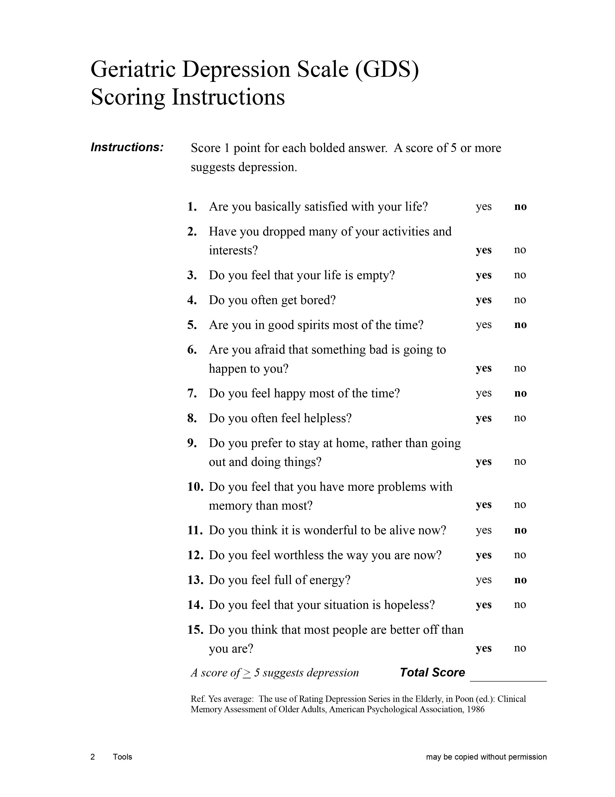

```{r message=FALSE, include=FALSE}
library(tidyverse)
library(lubridate)
library(scales)
source("../helper_functions.R")
library(RColorBrewer)
# display.brewer.all(colorblindFriendly = TRUE)
```


<!-- # Geriatric Depression Scale - short form -->
<!-- ```{r echo=FALSE} -->
<!-- include_graphics(path = "Data/Raw/Depressão/Geriatric Depression Scale.pdf") -->

<!-- ``` -->




```{r}

```


# Tabela depression
```{r, echo=FALSE}
depression <- readRDS("../Data/Processed/df_depression")

depression
```

<!-- # Total number of patients with depression -->
```{r include = FALSE}
n_patients <- depression %>% 
  count(PATNO) %>% 
  nrow()

n_patients
```

<!-- # Quais anos foram analisados na pesquisa -->
```{r include = FALSE}
year_max <- max(as.integer(depression$year))

year_min <- min(as.integer(depression$year))
```


# Patients with depression during 2010 - 2020

> Depression was defined acording with the Geriatric Depression Scale short version (GDS)
>
> The GDS is a 15-question screening tool for depression in older adults, requiring "yes" or "no" answers 
>
> Of the 15 items, 10 indicated the presence of depression when answered positively, while the rest (question numbers 1, 5, 7, 11, 13) indicated depression when answered negatively
>
> A score equal or above 5 is suggestive of depression 
>

```{r echo=F}
depression %>%
  count(year, depressive) %>%
  group_by(year) %>% 
  mutate(percentage_depressive = n / sum(n)*100) %>% 
  arrange(year) %>%   
  ggplot(aes(x = year, 
             y = percentage_depressive, 
             fill = depressive)) +
  geom_col() +
  geom_label(aes(label = round(percentage_depressive, 2) %>% paste(. , "%")),
             position = position_stack(vjust = 0.5),
             label.size = 0,
             size = 3,
             fontface = "bold",
             alpha = 0,
             show.legend = FALSE,
             colour = "white") +
  labs(title = paste0("Depression prevalence ", "(", year_max, " - ", year_min, ")"),
       subtitle = paste0("Number of patients analyzed: n = ", n_patients),
       x = "",
       y = "%",
       fill = "") +
  scale_fill_brewer(palette = "Dark2",
                    labels = c("Healthy", "Depressive")) +
  theme_classic() +
 theme(legend.position = "top",
        plot.title = element_text(hjust = 0.5, 
                                  margin = margin(0,0,10,0)),
       plot.subtitle = element_text(hjust = 0.5, 
                                  margin = margin(0,0,20,0)),
        axis.text = element_text(colour = "black",
                                 size = 10),
        axis.title = element_text(face = "bold",
                                  size = 12))
```

# Gender of patients with depression
```{r echo=FALSE}
depression %>%
  filter(depressive == "TRUE") %>% 
  count(year, gender) %>%
  group_by(year) %>% 
  mutate(percentage_depressive = n / sum(n)*100) %>% 
  arrange(year) %>%   
  ggplot(aes(x = year, 
             y = percentage_depressive, 
             fill = gender)) +
  geom_col() +
  geom_label(aes(label = round(percentage_depressive, 2) %>% paste(. , "%")),
             position = position_stack(vjust = 0.5),
             label.size = 0,
             size = 3,
             fontface = "bold",
             alpha = 0,
             show.legend = FALSE) +
  labs(title = "Gender of patients with depression (2010 - 2020)",
       x = "",
       y = "%",
       fill = "") +
   scale_fill_brewer(palette = "Purples",
                    labels = c(paste0("Female"), paste0("Male"))) +
  theme_classic() +
 theme(legend.position = "top",
        plot.title = element_text(hjust = 0.5, 
                                  margin = margin(0,0,20,0)),
       axis.text = element_text(size = 10),
        axis.title = element_text(size = 10))
```


# Gender of healthy patients
```{r echo=FALSE}
depression %>%
  filter(depressive == "FALSE") %>% 
  count(year, gender) %>%
  group_by(year) %>% 
  mutate(percentage_depressive = n / sum(n)*100) %>% 
  arrange(year) %>%   
  ggplot(aes(x = year, 
             y = percentage_depressive, 
             fill = gender)) +
  geom_col() +
  geom_label(aes(label = round(percentage_depressive, 2) %>% paste(. , "%")),
             position = position_stack(vjust = 0.5),
             label.size = 0,
             size = 3,
             fontface = "bold",
             alpha = 0,
             show.legend = FALSE) +
  labs(title = "Gender of healthy patients (2010 - 2020)",
       x = "",
       y = "%",
       fill = "") +
  scale_fill_brewer(palette = "Reds",
                    labels = c(paste0("Female"), paste0("Male"))) +
  theme_classic() +
 theme(legend.position = "top",
        plot.title = element_text(hjust = 0.5, 
                                  margin = margin(0,0,20,0)),
       axis.text = element_text(size = 10),
       axis.title = element_text(size = 10))
```


# Depression severity

The GDS has a more detailed scoring rate for depression. A score of:

> 0-4 = Healthy (without depression)
>
> 5-8 = Mild depression
> 
> 9-11 = Moderate depression
> 
> 12-15 = Severe depression

```{r echo=FALSE}
depression %>% 
  count(depression_category) %>% 
  mutate(perc_by_category = n/sum(n) * 100) %>% 
  ggplot(aes(x = depression_category,
             y = perc_by_category,
             fill = depression_category)) +
  geom_col(position = position_dodge()) +
  geom_label(aes(label = round(perc_by_category, 2) %>% paste0(. , "%")),
             position = position_dodge(width = 1),
             vjust = -0.1,
             label.size = 0,
             size = 3,
             fontface = "bold",
             alpha = 0,
             show.legend = FALSE) +
  ylim(0,100) +
  labs(title = "Depression Severity",
       subtitle = str_wrap(string = "The Geriatric Depression Scale classifies depression in 3 categories 
       according with its severity", width = 70),
       x = "Depression severity",
       y = "%",
       fill = "") +
  scale_fill_brewer(palette = "Dark2") +
  theme_classic() +
  theme(legend.position = "none",
        plot.title = element_text(hjust = 0.5, 
                                  margin = margin(0,0,10,0),
                                  size = 15,
                                  face = "bold"),
        plot.subtitle = element_text(hjust = 0.5, 
                                  margin = margin(0,0,30,0),
                                  size = 12),
        axis.text = element_text(colour = "black",
                                 size = 10),
        axis.title.x = element_text(vjust = -1),
        axis.title = element_text(size = 10))
```

<!-- # Alternativa ao grafico acima: um waffle plot -->
<!-- ```{r} -->
<!-- library(waffle) -->
<!-- library(extrafont) -->
<!-- library(emojifont) -->
<!-- load.fontawesome() -->

<!-- counts <- depression %>% -->
<!--   group_by(year,PATNO) %>%  -->
<!--   filter(year == 2016) %>%  -->
<!--   # count(depressive) %>%  -->
<!--   # filter(n == 5) -->
<!--   # pull(depression_category) %>% -->
<!--   table() -->


<!-- waffle(counts / 50, -->
<!--        xlab = "1 square = 50 patients") -->
<!-- ``` -->


# Depression rate according with the depression status 

Depression timeline = shows the evolution of depression during the years analyzed

During the analyzes was observed that depressive patients from time to time were diagnosed as healthy, or healthy patients sometimes were diagnosed as depressive. 
Considering these changes in depression diagnosis, the patients were grouped as: 

> * Constant healthy: patients without depression 
> * Constante depressive: pacientes who were diagnosed with depression in all time points 
> * Became depressive: patients who were initially healthy, but were diagnosed with depression in some time point 
> * Became healthy: patinets who showed a depression diagnosis, but in some time point were diagnosed as healthy
Patients with only one entry (single data) in the GDS were exluded from the future analysis.


```{r echo=FALSE}
depression %>% 
  count(depressive_status) %>% 
  mutate(perc_by_status = n/sum(n) * 100) %>% 
  ggplot(aes(x = reorder(x = depressive_status,
                         X = - perc_by_status),
             y = perc_by_status,
             fill = depressive_status)) +
  geom_col(position = position_dodge()) +
  geom_label(aes(label = round(perc_by_status, 2) %>% paste0(. , "%")),
             position = position_dodge(width = 0.5),
             vjust = -0.1,
             label.size = 0,
             fontface = "bold",
             alpha = 0,
             show.legend = FALSE) +
  ylim(0,100) +
  labs(title = "Depression Timeline",
       subtitle = str_wrap(string = "Some patients had the diagnisis of depression all the way, while others alternate between depressive and healthy",
                           width = 60),
       x = "",
       y = "%",
       fill = "") +
  scale_fill_brewer(palette = "Dark2") +
  theme_classic() +
  theme(legend.position = "none",
        plot.title = element_text(hjust = 0.5, 
                                  margin = margin(0,0,10,0),
                                  size = 15,
                                  face = "bold"),
        plot.subtitle = element_text(hjust = 0.5, 
                                     margin = margin(0,0,30,0),
                                     size = 12),
        axis.text = element_text(size = 10),
        axis.title = element_text(size = 10))
```

# Depression timeline vs. severity 

Evaluate if there is a relation between changes in depression diagnosis (depression timeline) and depression severity.
Could patients with constant depressive diagnosis show higher rates of depression severity?

>
> * Result: Patients with constant depression showes higher rate of severe depression compared with the other depression status. However, Mild and Moderate depression were higher in constant depressive patients.
>

Constant healthy patients were excluded from this analyzes, since this group shows a 100% diagnosis of Normal

```{r echo=FALSE}
depression %>% 
  filter(depressive_status %in% c("constant_depressive",
                                  "became_depressive", 
                                  "became_healthy")) %>%  
  count(depressive_status, depression_category) %>% 
  group_by(depressive_status) %>% 
  mutate(perc_status_by_category = n/sum(n) * 100) %>% 
  ggplot(mapping = aes(x = depression_category, 
                       y = perc_status_by_category,
                       fill = depressive_status)) +
  geom_col(position = position_dodge()) +
  geom_label(aes(label = round(perc_status_by_category, 2) %>% paste0(. , "%")),
             position = position_dodge(0.9), 
             hjust = 0,
             fontface = "bold",
             label.size = 0,
             alpha = 0,
             size = 3) +
  labs(title = "Depression Severity x Depression Timeline",
       subtitle = "Does the patients with constant depressive diagnosis present 
       more severe forms of depression?",
       x = "Depression severity",
       y = "%", 
       fill = "Depression timeline") +
  scale_y_continuous(limits = c(0,100)) +
  scale_fill_brewer(palette = "Dark2",
                    labels = c("Became depressive", 
                               "Became healthy", 
                               "Constant depressive")) +
  theme_classic() +
  theme(legend.position = "right",
        plot.title = element_text(hjust = 0.5, 
                                  margin = margin(0,0,10,0),
                                  size = 15,
                                  face = "bold"),
        plot.subtitle = element_text(hjust = 0.5, 
                                     margin = margin(0,0,30,0),
                                     size = 11),
        axis.text = element_text(colour = "black",
                                 size = 10),
        axis.title.y = element_text(size = 10, 
                                    margin = margin(0,10,0,0)),
        axis.title.x = element_text(size = 10, 
                                      margin = margin(10,0,0,0))) +
  coord_flip()
```


<!-- # Temporal profile/ Depression spectrum/Depression course -->

<!-- * The depression course is a temporal classification of the depression diagnosis; thus, showing the if the patient remained longer periods as depressive or as healthy. -->

<!-- <!-- O espectro de depressão é uma classificação temporal do diagnóstico e depressão, permitindo observar se o paciente permaneceu mais tempo depressivo ou saudável. --> -->

<!-- Como o estudo é longitudinal, os pacientes responderam o questionario de depressão pelo menos uma vez por ano. Assim temos várias análises de depressão de um mesmo paciente, sendo possivel que um paciente depressivo tenha sido tratado durante os anos do estudo e não tenha mais diagnostico de depressão (passando a ser saudável). Desta forma, buscamos investigar qual foi o diagnostico de depressão por paciente ao longo dos anos e para isso fizemos a análise do curso de depressão. -->

<!-- Exemplo: Paciente X respondeu ao questionário GDS de 2010 a 2015, e o diagnóstico de depressão de cada ano segue abaixo: -->

<!-- * 2010: depressivo -->
<!-- * 2011: saudável -->
<!-- * 2012: depressivo -->
<!-- * 2013: saudável -->
<!-- * 2014: depressivo -->
<!-- * 2015:depressivo -->

<!-- Considerando o diagnóstico de depressão, definimos uma escala de 1 a 0, sendo: -->

<!-- > Depressão = 1  -->
<!-- > -->
<!-- > Saudável = 0 -->

<!-- Tirando a média dos valores do paciente, temos: -->

<!-- > 4/6 = 0.66 -->

<!-- O valor de 0.66 para o paciente X nos mostra que esse paciente não permaneceu depressivo durante todo o periodo da analise, senao a sua media seria = 1, mas também não permaneceu saudavel o tempo todo, não apresentando a média = 0. Assim, esse valor nos mostra que esse paciente teve uma mudança no resultado do questionario, porém permaneceu mais no espectro depressivo.  -->

<!-- ```{r message = F} -->
<!-- depression %>% -->
<!--   filter(depressive_status != "single_data") %>%  -->
<!--   group_by(PATNO) %>%  -->
<!--   filter(depressive_status %in% c("became_depressive", "became_healthy")) %>%  -->
<!--   mutate(perc_depression = mean(depressive)) %>%  -->
<!--   ggplot() + -->
<!--   geom_density(aes(x = perc_depression,  -->
<!--                    colour = depressive_status), -->
<!--              size = 1) + -->
<!--   labs(title = "Depressive spectrum", -->
<!--        subtitle = "Diagnosis and course of depression ", -->
<!--        x = "", -->
<!--        y = "density", -->
<!--        colour = "Depressive status") + -->
<!--   xlim(0,1) + -->
<!--   scale_colour_manual(values = safe_colorblind_palette) + -->
<!--   theme_classic() + -->
<!--   theme(plot.title = element_text(hjust = 0.5,  -->
<!--                                   margin = margin(0,0,10,0)), -->
<!--         plot.subtitle = element_text(hjust = 0.5,  -->
<!--                                   margin = margin(0,0,30,0)), -->
<!--         axis.text = element_text(colour = "black", -->
<!--                                  size = 10), -->
<!--         axis.title = element_text(face = "bold", -->
<!--                                   size = 12)) -->
<!-- ``` -->

<!-- # Selecionar pacientes que responderam o questionario 4x -->
<!-- ```{r} -->
<!-- four_times_responde <- depression %>%  -->
<!--   group_by(PATNO) %>%  -->
<!--   mutate(numb_entries = n()) %>%  -->
<!--   filter(numb_entries == 4) %>%  -->
<!--   select(-numb_entries) -->
<!-- ``` -->


<!-- # Avaliar o espectro de depressao em pacientes que responderam o questionario 4x -->
<!-- ```{r } -->
<!-- four_times_responde %>%  -->
<!--   filter(depressive_status != "single_data") %>%  -->
<!--   group_by(PATNO) %>%  -->
<!--   filter(depressive_status %in% c("became_depressive", "became_healthy")) %>%  -->
<!--   mutate(perc_depression = mean(depressive)) %>%  -->
<!--   ggplot() + -->
<!--   geom_density(aes(x = perc_depression,  -->
<!--                    colour = depressive_status), -->
<!--              size = 1) + -->
<!--   labs(title = "Depression Spectrum", -->
<!--        subtitle = " ", -->
<!--        x = "Depression Spectrum", -->
<!--        y = "Density", -->
<!--        colour = "Depressive Timeline") + -->
<!--   xlim(0,1) + -->
<!--   scale_colour_manual(values = safe_colorblind_palette) + -->
<!--   annotate("segment", x = 0, xend = 1, y = -0.5, yend = -0.5, colour = "black", size=1, alpha=1, arrow=arrow()) + -->
<!--   annotate("text", x = 0.5, y = -0.3, yend = -0.3, colour = "black", label = ("Time that the patients remained depressive")) + -->
<!--   # annotate("") -->
<!--   theme_classic() + -->
<!--   theme(plot.title = element_text(hjust = 0.5,  -->
<!--                                   margin = margin(0,0,10,0)), -->
<!--         plot.subtitle = element_text(hjust = 0.5,  -->
<!--                                   margin = margin(0,0,30,0)), -->
<!--         axis.text = element_text(colour = "black", -->
<!--                                  size = 10), -->
<!--         axis.title = element_text(face = "bold", -->
<!--                                   size = 12)) -->


<!-- ``` -->